TRANG WEB BÁN ĐIỆN THOẠI

1. Đề tài hướng đến việc thiết kế và xây dựng hệ thống website bán điện thoại, cụ thể đạt được các mục tiêu sau:  
   Về mặt chức năng:
   - Website cho phép khách hàng xem, tìm kiếm sản phẩm, thêm giỏ hàng, đặt hàng.
   - Hệ thống quản trị (admin) quản lý toàn bộ dữ liệu về sản phẩm, đơn hàng, khách hàng.
   - Hệ thống hỗ trợ thống kê, báo cáo doanh thu, sản phẩm bán chạy.  

   Về kỹ thuật:
   - Phát triển theo mô hình 3 lớp: Controller – Service – Repository.
   - Áp dụng Spring Boot để xây dựng backend mạnh mẽ, bảo mật, mở rộng dễ dàng.
   - Sử dụng Thymeleaf + Bootstrap để xây dựng frontend thân thiện, responsive.
   - Áp dụng Spring Data JPA thao tác với cơ sở dữ liệu một cách tối ưu.
   - Hệ thống có thể triển khai dễ dàng trên hosting hoặc máy chủ nội bộ.

2. Chức năng của phần mềm  
   Chức năng dành cho khách hàng:  
   - Đăng ký / đăng nhập tài khoản
   - Duyệt sản phẩm theo danh mục, hãng, giá
   - Xem chi tiết sản phẩm
   - Thêm sản phẩm vào giỏ hàng
   - Đặt hàng, nhập thông tin nhận hàng
   - Xem trạng thái đơn hàng đã đặt
   - Hủy đơn hàng nếu chưa xử lý  

   Chức năng dành cho quản trị viên (admin):  
   - Đăng nhập admin
   - Quản lý sản phẩm: thêm – sửa – xoá
   - Quản lý danh mục sản phẩm (Samsung, iPhone…)
   - Quản lý đơn hàng: xác nhận, cập nhật trạng thái, huỷ đơn
   - Quản lý khách hàng
   - Thống kê doanh thu theo tháng, năm

3. Công nghệ sử dụng
   - Ngôn ngữ lập trình Java
   - Spring Boot
   - Thymeleaf
   - Bootstrap
   - MySQL

4. Biểu đồ Use-case 
   - Tổng quát  
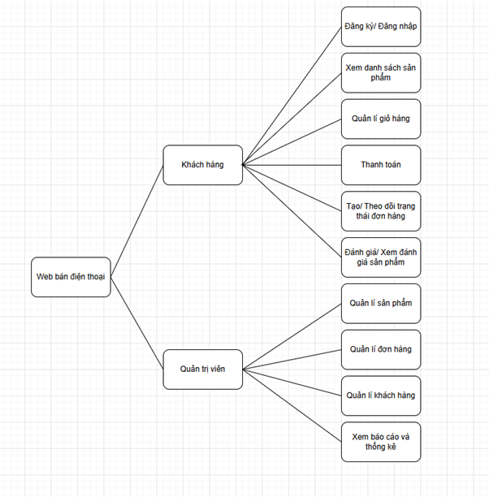  
   - Quản trị viên  
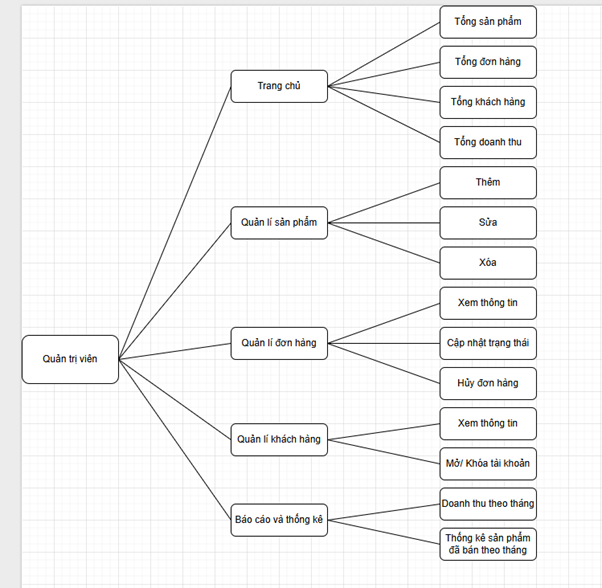  
   - Khách hàng  
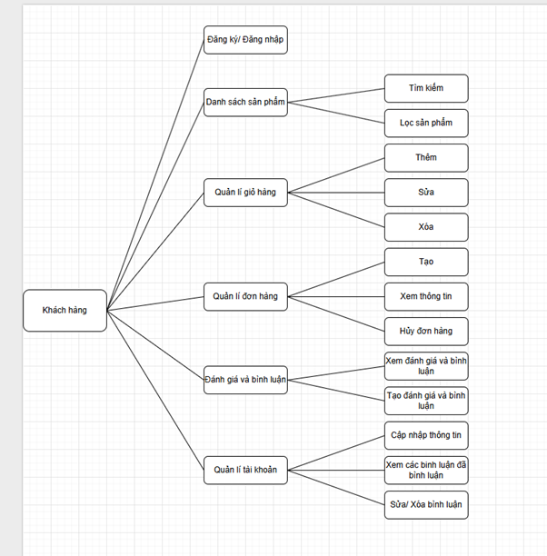  

5. Ảnh demo
   - Giao diện đăng nhập    
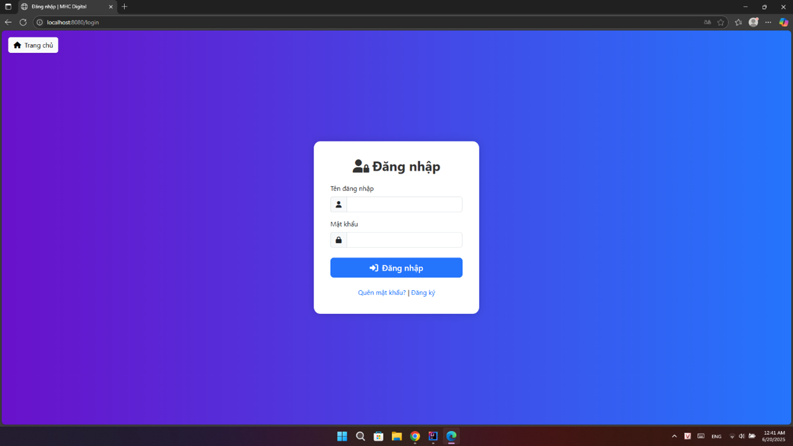  
   - Giao diện đăng ký    
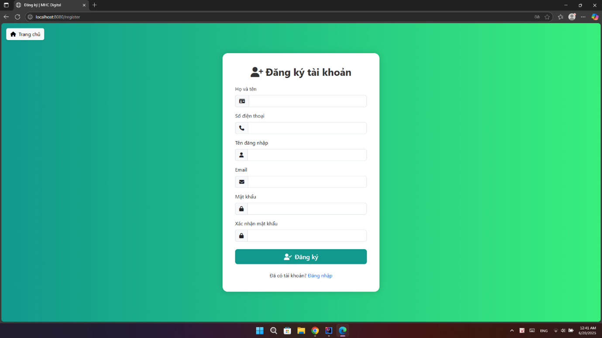  
   - Giao diện trang chủ   
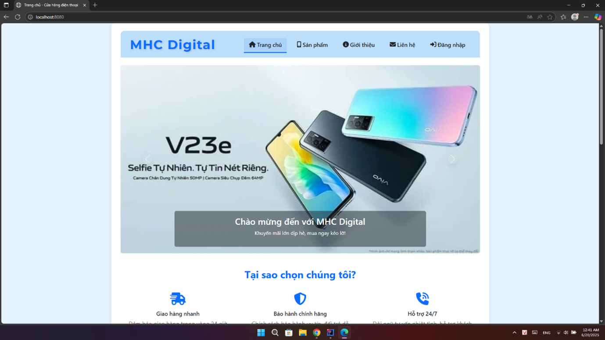  
   - Giao diện trang sản phẩm  
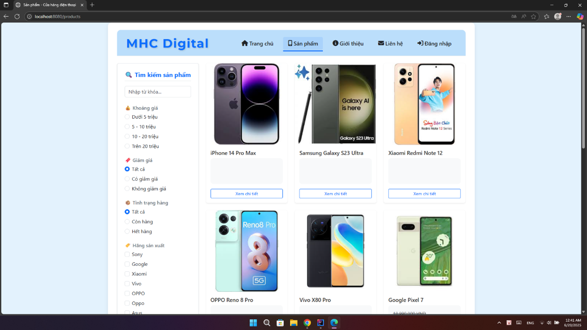  
   - Giao diện trang giới thiệu về trang web  
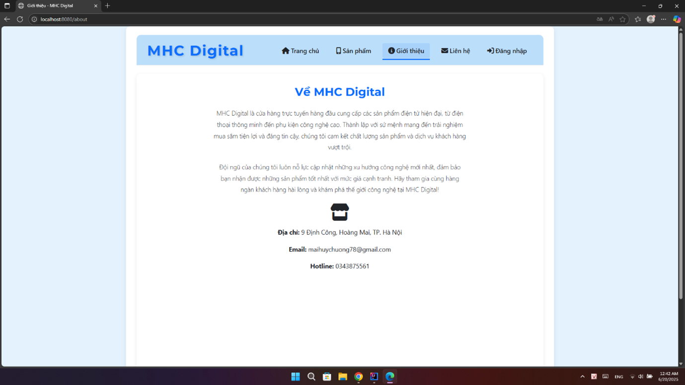  
   - Giao diện trang liên hệ của trang web  
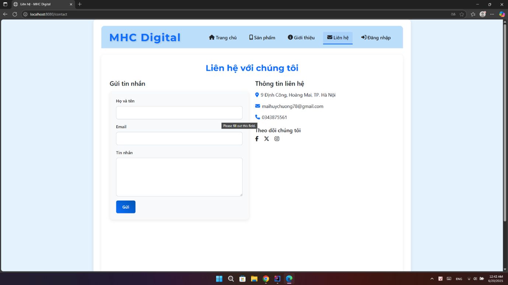  
   - Giao diện trang  chi tiết sản phẩm  
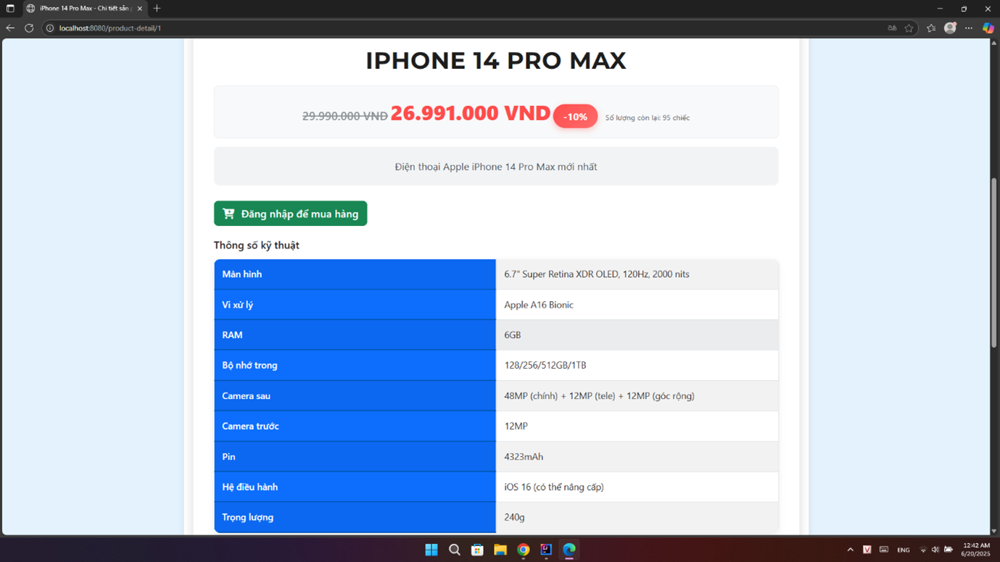  
   - Giao diện phần  đánh giá và bình luận  
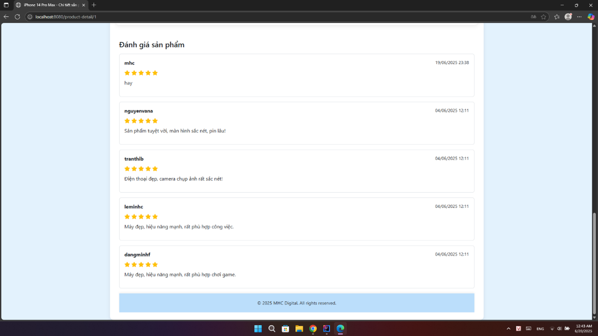  
   - Giao diện quản lí tài khoản của khách hàng  
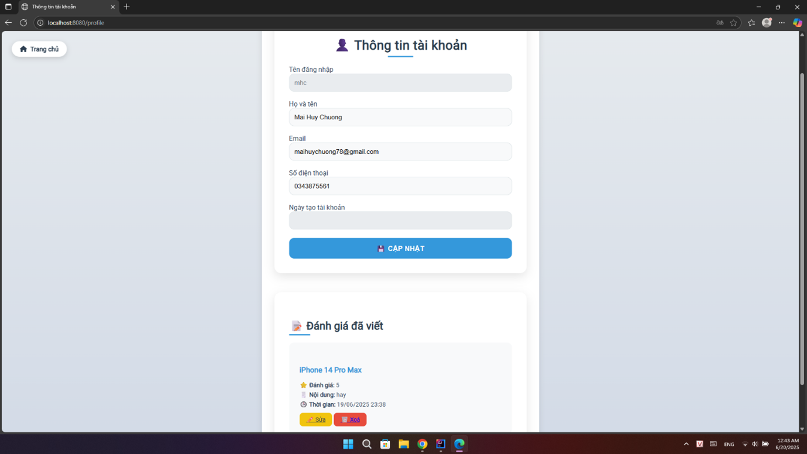  
   - Giao diện giỏ hàng của khách hàng  
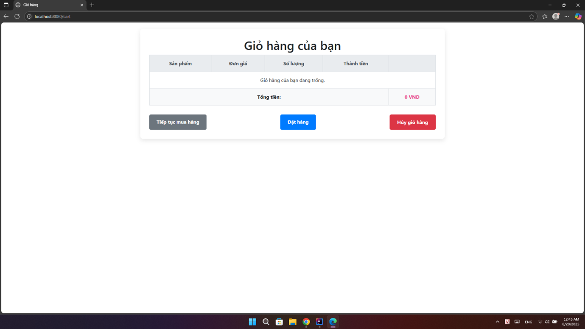  
   - Giao diện đơn hàng của khách hàng  
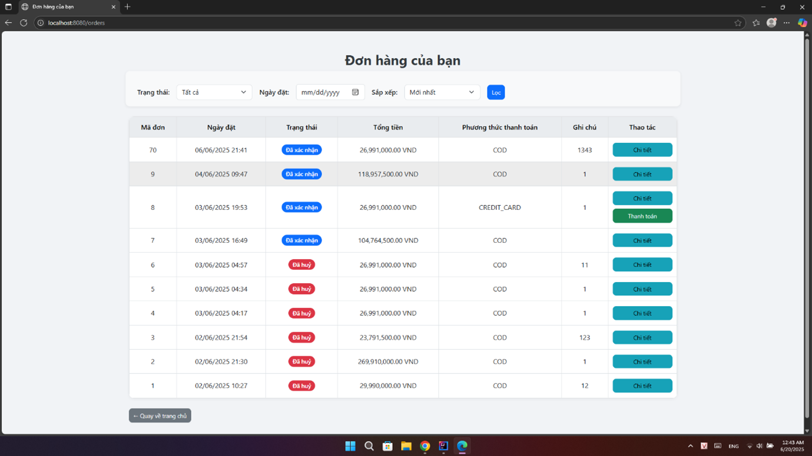  
   - Giao diện chính của trang admin  
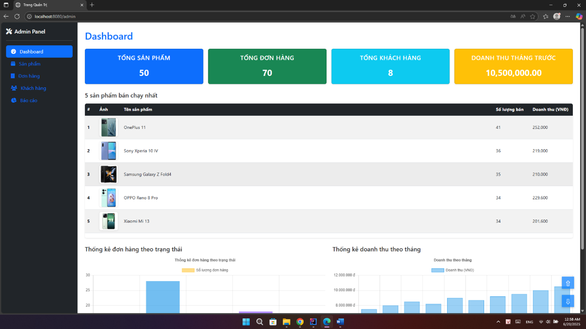  
   - Giao diện quản lí sản phẩm của trang admin
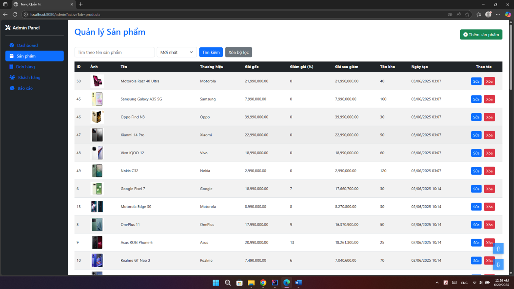  
   - Giao diện quản lí đơn hàng của trang admin  
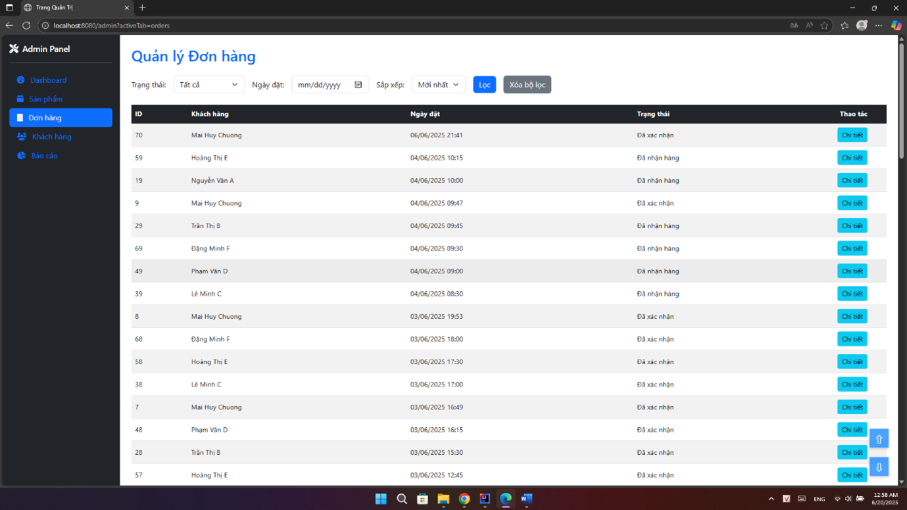  
   - Giao diện quản lí khách hàng của trang admin  
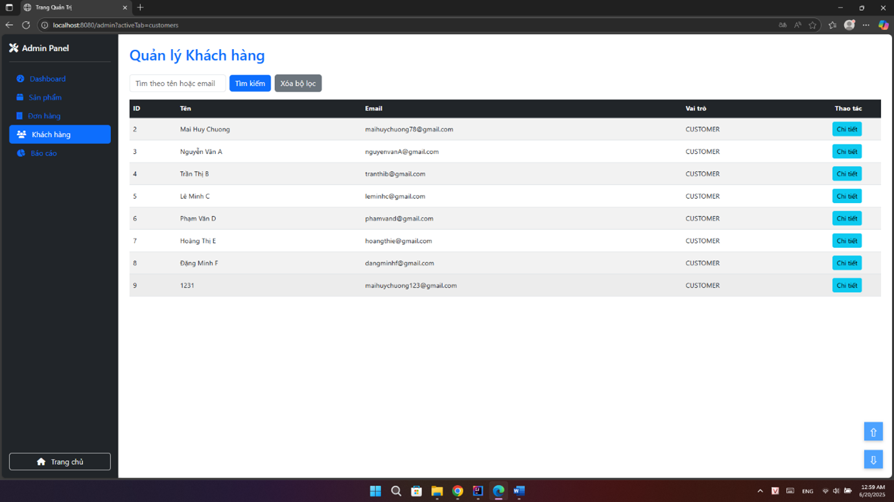  
   - Giao diện báo cáo thống kê của trang admin
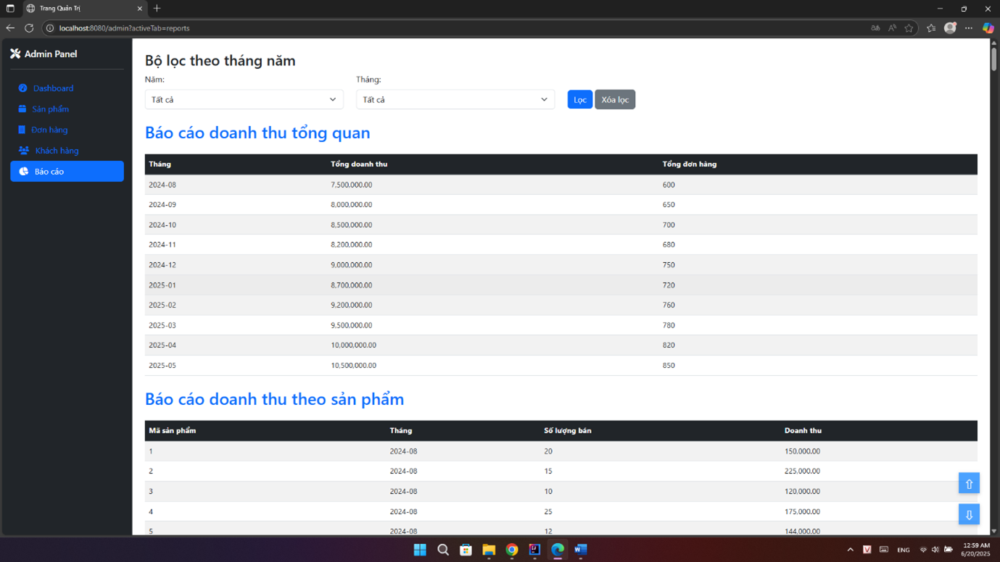  

